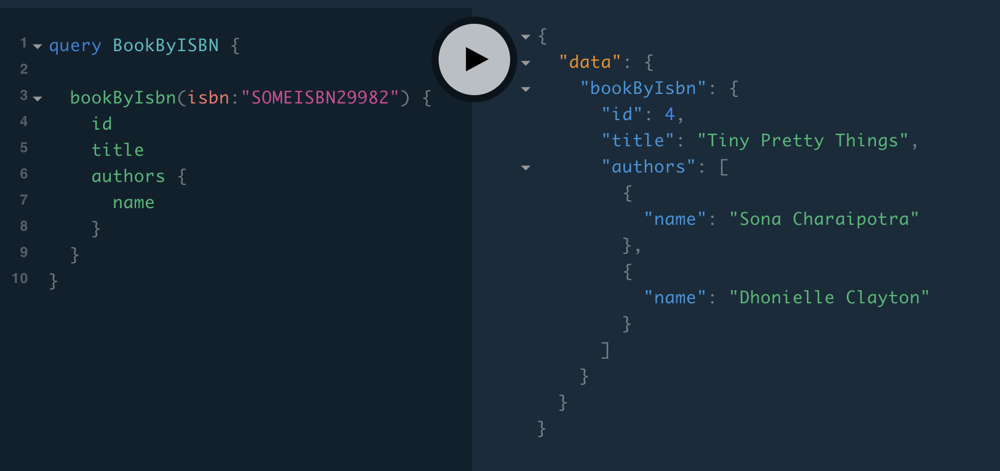
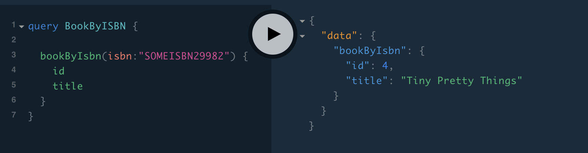

# Why GraphQL?

## Does GraphQL fetch the data from db and chips off the extra columns?

Though the db interaction is up to JPA, lets see how efficient the interaction between these two components.
So it should be rephrased as _whether GraphQL can tell JPA to exclude fields that are not necessary?_ 

In the following use-case, a nested entity queried. 

### Fetching book info along with author list



In this case, both book and author info requested by the query. To honor the same, two queries has been executed, and the response constructed as nested entity.


```sql
select 
    book0_.id as id1_1_, 
    book0_.isbn as isbn2_1_, 
    book0_.title as title3_1_ 
from 
    books book0_ 
where book0_.isbn=?

select 
    authors0_.book_id as book_id1_2_0_, 
    authors0_.author_id as author_i2_2_0_, 
    author1_.id as id1_0_1_, 
    author1_.name as name2_0_1_ 
from link_book_author authors0_ 
inner join 
    authors author1_ on authors0_.author_id=author1_.id 
where 
    authors0_.book_id=?
```

### Fetching book info



Above query fetches a single book by ISBN and the respective query to the db as follows.

```sql
select 
    book0_.id as id1_1_, 
    book0_.isbn as isbn2_1_, 
    book0_.title as title3_1_ 
from books book0_ 
where book0_.isbn=?
```

There are two things to notice here:

1. ISBN column included to the sql query, even though it is not requested by the client
2. Since the authors section is not requested, the second join query to the mapping table is not executed.

So the interaction between the JPA repository and GraphQL is smart enough to avoid N+1 queries. All under a single endpoint and client has control over what to fetch.


## More to come

Above gives an idea of how nested entities handled with GraphQL. Let's cover some more use-cases at high level.

### Add depth to the author entity

Assume, the author has contact info (list of addresses and phone numbers)

```
Author
 - Contact info
 +- Phone [
 +-- { number }
 ]
 +- Address [
 +-- { line1, line2, zip }
 +-- { line1, line2, zip }
 ]
```
  
It is totally possible to include the additional mappings, without touching the book entity.

### Add breadth to the book entity

Add some trivia to the book, quotes from the book or publisher info.

```
Book
+-Quotes[
+--- { page, quote }
+]
+-Trivia[
+--- { description, reference }
+]
+-PublishedBy { name, year}
```

Entity can grow but fetched only as per client request. *No more tailoring the API for each usecase*.  